# rass-api
Reference Specification for the RASS Server

The RASS philosophy centers on decoupling document storage from advanced semantic search, allowing organizations to maintain full control over their original data while enabling powerful, context-aware retrieval capabilities. Traditional search systems often require applications to tightly integrate with specific storage engines or indexing strategies, leading to complexity, vendor lock-in, and challenges in scaling or evolving the underlying architecture. By introducing a minimalistic, API-driven layer that handles vectorization and semantic search independently of the application's own storage, RASS empowers teams to innovate and adapt without sacrificing data ownership or flexibility. This approach is essential for organizations that need to support diverse applications, future-proof their infrastructure, and deliver fast, relevant search experiences without being constrained by the limitations of any single backend technology.

## Features

✅ **Pluggable Backend Architecture** - Switch between simulated and OpenSearch backends via configuration  
✅ **OpenAPI/Swagger Documentation** - Interactive API documentation at `/docs`  
✅ **Multiple Application Support** - Built for Redmine, MediaWiki, RocketChat and more  
✅ **Configurable Authentication** - Optional API key authentication  
✅ **Docker Compose Support** - Ready-to-use OpenSearch setup  
✅ **TypeScript Implementation** - Full type safety and modern development experience  

## Quick Start

### Prerequisites

- Node.js 18+ 
- npm or yarn
- Docker and Docker Compose (for OpenSearch mode)

### Installation

1. **Clone the repository**
   ```bash
   git clone https://github.com/mieweb/rass-api.git
   cd rass-api
   ```

2. **Install dependencies**
   ```bash
   npm install
   ```

3. **Build the project**
   ```bash
   npm run build
   ```

## Usage

### Running in Simulated Mode (Default)

The simulated mode uses deterministic mock responses and is perfect for development, testing, and client library generation.

```bash
# Start in development mode with hot reload
npm run dev

# Or start production build
npm start
```

The server will start at `http://localhost:3000` with:
- API endpoints available for testing
- Swagger UI at `http://localhost:3000/docs`
- Sample documents pre-loaded for testing

### Running with OpenSearch Backend

#### Option 1: Using Docker Compose (Recommended)

1. **Start OpenSearch and the API server**
   ```bash
   docker-compose up -d
   ```

   This will start:
   - OpenSearch at `http://localhost:9200`
   - OpenSearch Dashboards at `http://localhost:5601`
   - RASS API at `http://localhost:3000`

2. **Check status**
   ```bash
   curl http://localhost:3000/health
   ```

#### Option 2: External OpenSearch Instance

1. **Set environment variables**
   ```bash
   export RASS_BACKEND=opensearch
   export OPENSEARCH_URL=http://your-opensearch-instance:9200
   export OPENSEARCH_INDEX=rass-documents
   # Optional authentication
   export OPENSEARCH_USERNAME=admin
   export OPENSEARCH_PASSWORD=admin
   ```

2. **Start the server**
   ```bash
   npm start
   ```

### Configuration Options

Create a `.env` file based on `.env.example`:

```bash
cp .env.example .env
```

Available configuration options:

| Variable | Default | Description |
|----------|---------|-------------|
| `RASS_BACKEND` | `simulated` | Backend type: `simulated` or `opensearch` |
| `HOST` | `localhost` | Server host |
| `PORT` | `3000` | Server port |
| `LOG_LEVEL` | `info` | Log level |
| `OPENSEARCH_URL` | `http://localhost:9200` | OpenSearch instance URL |
| `OPENSEARCH_INDEX` | `rass-documents` | OpenSearch index name |
| `OPENSEARCH_USERNAME` | - | OpenSearch username (optional) |
| `OPENSEARCH_PASSWORD` | - | OpenSearch password (optional) |
| `AUTH_ENABLED` | `false` | Enable API key authentication |
| `API_KEY` | - | API key for authentication |

### Authentication

Enable authentication by setting environment variables:

```bash
export AUTH_ENABLED=true
export API_KEY=your-secret-api-key
```

When authentication is enabled, include the API key in requests:

```bash
curl -H "X-API-Key: your-secret-api-key" http://localhost:3000/embed
```

**Note:** The `/health` endpoint and `/docs` are always accessible without authentication.

## API Usage Examples

### 1. Embed a Document

```bash
curl -X POST http://localhost:3000/embed \
  -H "Content-Type: application/json" \
  -d '{
    "id": "doc-123",
    "content": "This is a document about machine learning and AI.",
    "metadata": {
      "title": "AI Overview",
      "source": "wiki",
      "application": "mediawiki",
      "author": "Dr. Smith",
      "url": "https://wiki.example.com/ai-overview"
    }
  }'
```

### 2. Search Documents

```bash
curl -X POST http://localhost:3000/search \
  -H "Content-Type: application/json" \
  -d '{
    "query": "machine learning artificial intelligence",
    "filters": {
      "application": "mediawiki",
      "source": "wiki"
    },
    "limit": 10,
    "offset": 0
  }'
```

### 3. Get a Specific Document

```bash
curl http://localhost:3000/item/doc-123
```

### 4. Refresh Embeddings

```bash
curl -X POST http://localhost:3000/refresh \
  -H "Content-Type: application/json" \
  -d '{
    "application": "mediawiki",
    "force": true
  }'
```

### 5. Health Check

```bash
curl http://localhost:3000/health
```

## API Documentation

Visit `http://localhost:3000/docs` when the server is running to access the interactive Swagger UI documentation.

The OpenAPI specification is available at:
- YAML format: [openapi.yaml](./openapi.yaml)
- JSON format: `http://localhost:3000/docs/json`

## Supported Applications

RASS is designed to work with multiple application types:

- **Redmine** - Project management and issue tracking
- **MediaWiki** - Wiki and documentation systems  
- **RocketChat** - Team communication and chat

Each application can specify its type in the metadata when embedding documents, allowing for application-specific filtering and organization.

## Development

### Scripts

```bash
npm run dev          # Start development server with hot reload
npm run build        # Build TypeScript to JavaScript
npm start           # Start production server
npm run lint        # Run ESLint
npm run lint:fix    # Fix ESLint issues
```

### Project Structure

```
rass-api/
├── src/
│   ├── backends/           # Backend implementations
│   │   ├── simulated.ts   # Mock backend for testing
│   │   └── opensearch.ts  # OpenSearch backend
│   ├── routes/            # API route handlers
│   │   ├── embed.ts
│   │   ├── search.ts
│   │   ├── item.ts
│   │   ├── refresh.ts
│   │   └── health.ts
│   ├── types/             # TypeScript type definitions
│   │   └── index.ts
│   ├── config/            # Configuration management
│   │   └── index.ts
│   └── server.ts          # Main server file
├── openapi.yaml           # OpenAPI specification
├── docker-compose.yml     # Docker Compose configuration
├── Dockerfile            # Docker image definition
├── package.json
└── README.md
```

### Adding New Backends

To add a new backend (e.g., PostgreSQL with pgvector):

1. Create a new file in `src/backends/` (e.g., `postgres.ts`)
2. Implement the `IRassBackend` interface
3. Add configuration options in `src/config/index.ts`
4. Update the backend selection logic in `src/server.ts`

## Docker

### Building the Docker Image

```bash
docker build -t rass-api .
```

### Running with Docker

```bash
# Simulated mode
docker run -p 3000:3000 rass-api

# OpenSearch mode
docker run -p 3000:3000 \
  -e RASS_BACKEND=opensearch \
  -e OPENSEARCH_URL=http://opensearch:9200 \
  rass-api
```

## Client Library Generation

The OpenAPI specification can be used to generate client libraries in various programming languages:

```bash
# Install OpenAPI Generator
npm install -g @openapitools/openapi-generator-cli

# Generate Python client
openapi-generator-cli generate \
  -i http://localhost:3000/docs/json \
  -g python \
  -o ./clients/python

# Generate JavaScript client  
openapi-generator-cli generate \
  -i http://localhost:3000/docs/json \
  -g javascript \
  -o ./clients/javascript
```

## Architecture Philosophy

The RASS philosophy is best illustrated by the relationship between a CEO, their executive assistant, and the company's official records room. In this model, the company's records room serves as the canonical source of truth, where all important documents are securely stored and maintained. The executive assistant, meanwhile, creates their own working copies or detailed notes about these documents, organizing them in a way that enables rapid, context-aware retrieval—even when the CEO's request is vague or based on partial information. When the CEO needs a specific proposal or report, the assistant quickly identifies the most relevant information using their own system, but always references the official records room to ensure accuracy and up-to-date content. This approach mirrors how RASS decouples document storage from semantic search: the application retains full control and ownership of the original data, while the RASS server maintains its own optimized representations for fast, intelligent retrieval. This dual-system philosophy is essential for organizations that want to preserve data integrity and flexibility, while still benefiting from the latest advances in semantic search and retrieval.


### Document Storage Flow

In the RASS architecture, document storage is designed to ensure both data integrity and efficient semantic retrieval. When a user submits a document through an application—such as Redmine or MediaWiki—the application first stores the original document in its own dedicated storage system, maintaining full control and ownership of the source data. Simultaneously, the application sends the document to the RASS API server, which processes and vectorizes the content, storing the resulting embeddings in a specialized embedding store. This dual-storage approach allows the application to remain the authoritative source of truth for documents, while enabling the RASS system to perform rapid, context-aware searches using advanced semantic techniques.

```mermaid
sequenceDiagram
    participant CEO as 👤 CEO (User)
    participant App as 📦 Application
    participant AppStore as 🗄️ App's Own Store
    participant RAS as 🧠 RASS API Server
    participant Backend as 💾 Embedding Store

    %% --- Document Storage Flow ---
    CEO->>App: Submit Document
    App->>AppStore: Store Document
    App->>RAS: Store Document API Call
    RAS->>Backend: Store & Vectorize Document
```



### Query Flow

The following diagram illustrates the query process within the RASS architecture. When a user initiates a search through the application, the request is routed to the RASS API server, which leverages its embedding store to perform a semantic or keyword-based search. The results are then returned to the application for display to the user. After the response is delivered, the RASS server evaluates the performance of the query and may generate recommendations to further optimize future searches.

```mermaid
sequenceDiagram
    participant CEO as 👤 CEO (User)
    participant App as 📦 Application
    participant AppStore as 🗄️ App's Own Store
    participant RAS as 🧠 RASS API Server
    participant Backend as 💾 Embedding Store
    participant Rec as ⚙️ Recommendation Engine

    %% --- Query Flow ---
    CEO->>App: Submit Query
    App->>RAS: Query API Call
    RAS->>Backend: Semantic / Keyword Search
    RAS->>App: Search Results
    App->>CEO: Results Display
    RAS->>Rec: Performance Feedback
    Rec->>RAS: Recommendations (e.g., re-rank, re-query)
```



## Troubleshooting

### Common Issues

1. **"Failed to connect to OpenSearch"**
   - Ensure OpenSearch is running: `curl http://localhost:9200`
   - Check the `OPENSEARCH_URL` configuration
   - Verify network connectivity if using remote OpenSearch

2. **"Authentication failed"**
   - Verify the API key is correct
   - Check that `AUTH_ENABLED=true` and `API_KEY` are set
   - Ensure the `X-API-Key` header is included in requests

3. **"Index creation failed"**
   - Check OpenSearch logs for detailed error messages
   - Ensure the user has permissions to create indices
   - Verify OpenSearch is not in read-only mode

### Logs

Check server logs for detailed error information:

```bash
# Development mode
npm run dev

# Production mode with debug logging
LOG_LEVEL=debug npm start
```

## Contributing

1. Fork the repository
2. Create a feature branch: `git checkout -b feature-name`
3. Make changes and add tests
4. Commit changes: `git commit -am 'Add feature'`
5. Push to the branch: `git push origin feature-name`
6. Create a Pull Request

## License

This project is licensed under the Apache License 2.0 - see the [LICENSE](LICENSE) file for details.