# rass-api
Reference Specification for the RASS Server

The RASS philosophy centers on decoupling document storage from advanced semantic search, allowing organizations to maintain full control over their original data while enabling powerful, context-aware retrieval capabilities. Traditional search systems often require applications to tightly integrate with specific storage engines or indexing strategies, leading to complexity, vendor lock-in, and challenges in scaling or evolving the underlying architecture. By introducing a minimalistic, API-driven layer that handles vectorization and semantic search independently of the application’s own storage, RASS empowers teams to innovate and adapt without sacrificing data ownership or flexibility. This approach is essential for organizations that need to support diverse applications, future-proof their infrastructure, and deliver fast, relevant search experiences without being constrained by the limitations of any single backend technology.

The RASS philosophy is best illustrated by the relationship between a CEO, their executive assistant, and the company’s official records room. In this model, the company’s records room serves as the canonical source of truth, where all important documents are securely stored and maintained. The executive assistant, meanwhile, creates their own working copies or detailed notes about these documents, organizing them in a way that enables rapid, context-aware retrieval—even when the CEO’s request is vague or based on partial information. When the CEO needs a specific proposal or report, the assistant quickly identifies the most relevant information using their own system, but always references the official records room to ensure accuracy and up-to-date content. This approach mirrors how RASS decouples document storage from semantic search: the application retains full control and ownership of the original data, while the RASS server maintains its own optimized representations for fast, intelligent retrieval. This dual-system philosophy is essential for organizations that want to preserve data integrity and flexibility, while still benefiting from the latest advances in semantic search and retrieval.

```mermaid
flowchart TD

  %% ======================
  %% Document Storage Flow
  %% ======================
  subgraph Storage_Flow["📥 Document Storage Flow"]
    CEO1["👤 CEO (User)"]
    App1["📦 Application<br/>(Redmine, MediaWiki, etc.)"]
    RAS1["🧠 RASS API Server"]
    Backend1["💾 Embedding Store<br/>(e.g., OpenSearch, pgvector)"]

    CEO1 -- "Submit Document" --> App1
    App1 -- "Store Document API Call" --> RAS1
    RAS1 -- "Store & Vectorize Document" --> Backend1
  end

  %% =================
  %% Query Flow
  %% =================
  subgraph Query_Flow["🔍 Query Flow"]
    CEO2["👤 CEO (User)"]
    App2["📦 Application"]
    RAS2["🧠 RASS API Server"]
    Backend2["💾 Embedding Store<br/>(e.g., OpenSearch, pgvector)"]
    RecEngine["⚙️ Recommendation Engine<br/>(optional ML feedback)"]

    CEO2 -- "Submit Query" --> App2
    App2 -- "Query API Call" --> RAS2
    RAS2 -- "Semantic / Keyword Search" --> Backend2
    RAS2 -- "Performance Feedback" --> RecEngine
    RecEngine -- "Recommendations (e.g., re-rank, re-query)" --> RAS2
    RAS2 -- "Search Results" --> App2
    App2 -- "Results Display" --> CEO2
  end
```

## Diagram

In the RASS architecture, document storage is designed to ensure both data integrity and efficient semantic retrieval. When a user submits a document through an application—such as Redmine or MediaWiki—the application first stores the original document in its own dedicated storage system, maintaining full control and ownership of the source data. Simultaneously, the application sends the document to the RASS API server, which processes and vectorizes the content, storing the resulting embeddings in a specialized embedding store. This dual-storage approach allows the application to remain the authoritative source of truth for documents, while enabling the RASS system to perform rapid, context-aware searches using advanced semantic techniques. This setup lays the foundation for the subsequent query process, where users will be able to retrieve relevant documents through natural language queries, leveraging the power of both the application’s storage and the RASS embedding store.

```mermaid
sequenceDiagram
    participant CEO as 👤 CEO (User)
    participant App as 📦 Application
    participant AppStore as 🗄️ App's Own Store
    participant RAS as 🧠 RASS API Server
    participant Backend as 💾 Embedding Store
    participant Rec as ⚙️ Recommendation Engine

    %% --- Document Storage Flow ---
    CEO->>App: Submit Document
    App->>AppStore: Store Document
    App->>RAS: Store Document API Call
    RAS->>Backend: Store & Vectorize Document
```

The following diagram illustrates the query process within the RASS architecture. When a user initiates a search through the application, the request is routed to the RASS API server, which leverages its embedding store to perform a semantic or keyword-based search. The results are then returned to the application for display to the user. After the response is delivered, the RASS server evaluates the performance of the query and may generate recommendations to further optimize future searches. This flow ensures that users receive relevant results quickly, while the system continuously improves its retrieval capabilities in the background.

```mermaid
sequenceDiagram
    participant CEO as 👤 CEO (User)
    participant App as 📦 Application
    participant AppStore as 🗄️ App's Own Store
    participant RAS as 🧠 RASS API Server
    participant Backend as 💾 Embedding Store
    participant Rec as ⚙️ Recommendation Engine

    %% --- Query Flow ---
    CEO->>App: Submit Query
    App->>RAS: Query API Call
    RAS->>Backend: Semantic / Keyword Search
    RAS->>App: Search Results
    App->>CEO: Results Display
    RAS->>Rec: Performance Feedback
    Rec->>RAS: Recommendations (e.g., re-rank, re-query)
```

